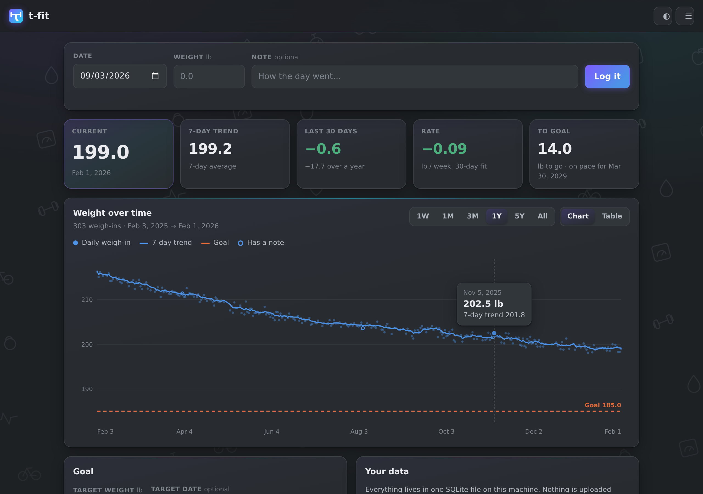

# t-fit

A small, fast, local-first, weight tracker — the part of [FitDay PC](https://en.wikipedia.org/wiki/FitDay) (Version 1.0) that I mostly used, rebuilt in Rust in 2026.

FitDay PC was abandoned around 2004 and its online service shut down in 2022. Version 1.0 has no export; unsure on any version after that. If you kept a decade of weigh-ins in it, that data is stuck inside a proprietary binary on a machine running an app that no longer gets updates. t-fit is the way out: one small binary, one SQLite file, a CSV export that works, and an optional Withings sync so a smart scale can keep it fed.

- **Local-first.** Your data is a single SQLite file on your own disk. Nothing is uploaded. There is no account and no server to sign up for.
- **One binary, two front doors.** Run it and an app window opens. Run it with `--serve 0.0.0.0` and you can log a weigh-in from your phone on the same Wi-Fi.
- **Yours to leave with.** `Export CSV` is one click and gives you every row, notes included.
- **A way out of FitDay.** `--import-fitday` reads FitDay PC's undocumented `.fdy` directly — dates, weights and full note text. No printing, no PDFs.



## Install

You need [Rust](https://rustup.rs) (1.75 or newer). SQLite is compiled in — there is nothing else to install.

```
git clone https://github.com/HuskerMinion/t-fit
cd t-fit
cargo build --release
```

The binary lands at `target/release/t-fit` (`t-fit.exe` on Windows). Put it wherever you like; it has no runtime dependencies.

## Use

```
t-fit                        # opens an app window on this machine
t-fit --tab                  # ordinary browser tab instead
t-fit --browser "C:\...\brave.exe"   # use a specific browser for the window
t-fit --serve 0.0.0.0        # headless; reachable from your phone at http://<this-machine>:8787
t-fit --port 9000            # different port
t-fit --db D:\health\me.db   # different database file
```

The app window is a Chromium browser launched in `--app=` mode: no tabs, no
address bar, so it reads as an application rather than a web page. t-fit uses
**your default browser** for this whenever it can. If your default isn't
Chromium-family — Firefox, say — it has no app mode, so t-fit opens a normal
tab in it rather than pulling in a browser you didn't choose. `--browser`
overrides the choice; `--tab` skips app mode entirely.

By default the database lives in your user data directory:

| | |
|---|---|
| Windows | `%APPDATA%\t-fit\t-fit\data\t-fit.sqlite3` |
| Linux | `~/.local/share/t-fit/t-fit.sqlite3` |
| macOS | `~/Library/Application Support/t-fit/t-fit.sqlite3` |

Copy that one file and you have copied everything — history, goal, settings
and your Withings link. **The app prints the exact path in Settings (☰) and
at `/api/version`**, which beats trusting a table in a README.

### Bringing your history in

```
t-fit --import weight_history.csv
```

The importer is deliberately forgiving. It wants a `date` column and a `weight` column; a `memo`, `note` or `comment` column comes along if present. Dates can be `2026-09-01`, `09/01/2026`, `1/9/2026` or an ISO timestamp. A raw Withings `weight.csv` works as-is — no editing needed.

Days already in the database are **kept, not overwritten**, so importing the same file twice is harmless. Pass `--overwrite` if you genuinely want the file to win.

If a day has several readings, the earliest is kept — the morning weigh-in, which is the one that is actually comparable day to day.

There is an `Import CSV` button in the UI that does the same thing.

### Getting your history out of FitDay PC

FitDay PC has no export. t-fit reads its file directly:

```
t-fit --import-fitday <name>Fit.fdy
```

Dates, weights, and the **full text** of every note — including the ones
FitDay's own printout truncates at the column width. A `.fbk` backup works
too.

```
read 803 days from <name>Fit.fdy (143 with notes)
  2009-09-14 → 2025-01-23
  added 803, already present 0
```

The `.fdy` format is undocumented, so this was reverse engineered;
[tools/fitday/FORMAT.md](tools/fitday/FORMAT.md) writes down what it is, and
[tools/fitday/](tools/fitday/) has a standalone Python version for anyone who
wants a CSV without building Rust. Validated against a 16-year, 803-entry
file with an independent ground truth: 803/803 weights and 143/143 notes
decoded exactly.

### Withings sync

Optional, and off until you set it up. t-fit talks to Withings with your own free developer app, so no credentials of mine (or anyone's) are baked into this repo.

1. Create a free **public** application at [developer.withings.com](https://developer.withings.com/dashboard/).
2. Set its callback URL to exactly the one t-fit shows you in the Withings card — `http://127.0.0.1:8787/api/withings/callback` unless you changed the port.
3. Paste the client ID and secret into t-fit and hit **Connect to Withings**.

The client ID, secret and tokens are stored in the `settings` table of your local database. They are never written to the source tree, and `.gitignore` keeps `*.sqlite3` out of git.

Once linked, t-fit syncs in the background on its own — every six hours by
default, adjustable from hourly to daily (or off) in Settings. It keys off
when the last sync actually succeeded, so restarting doesn't trigger a
needless pull. `Sync now` forces one whenever you want.

Sync only ever **adds days you don't already have**. A weight you typed by hand, and the note attached to it, will never be replaced by a scale reading.

If something goes wrong, the reason is kept and shown on the Withings card — it survives closing the approval tab and restarting the app. `Dismiss` clears it. You can also check from a shell:

```
curl -s localhost:8787/api/withings/status
```

`configured` means the client ID and secret are saved; `linked` means tokens are held and a sync will work.

If you run t-fit behind a different origin, tell it so the redirect matches:

```
t-fit --base-url http://192.168.1.20:8787 --serve 0.0.0.0
```

## What's in it

- A weigh-in per day, with a note.
- A chart: every reading as a faint dot, a 7-day trend line over the top, a goal line, crosshair and tooltip. The trend line runs unbroken, but a stretch with no weigh-ins for over three weeks is bridged with a dashed segment rather than a solid one — connected, without pretending those weeks were measured.
- Current, 7-day trend, 30-day change, rate in lb/week (least-squares over 30 days), and how far ahead of or behind your goal pace you are.
- **A goal pace line**: set a target weight *and date* and the chart draws the straight line from where you started to where you're aiming. Your trend sitting above or below it is the answer to "am I on track?" — which a flat line at the target can't tell you.
- A table view with day-over-day deltas and delete. Notes sit on one line and expand when tapped, so a long note never squeezes the date column on a phone.
- Light and dark, following your system by default.
- A settings drawer (☰, top right) for the default time range, which view opens first, whether raw weigh-ins are drawn, and the theme.
- CSV in, CSV out.

The moving averages use a **day window, not a sample window**, so a gap in logging doesn't quietly distort the trend.

## API

The UI is just a client. Everything it does is available over HTTP, which makes scripting easy:

| Method | Path | |
|---|---|---|
| `GET` | `/api/entries` | every entry, oldest first |
| `POST` | `/api/entries` | `{date, weight_lb, memo}` — upsert |
| `DELETE` | `/api/entries/:date` | |
| `GET` | `/api/stats` | the numbers behind the tiles |
| `GET` | `/api/series?days=90` | plot-ready points with the 7-day trend |
| `GET` / `PUT` | `/api/goal` | |
| `POST` | `/api/import?overwrite=false` | CSV body |
| `GET` | `/api/export.csv` | |
| `GET` / `PUT` | `/api/prefs` | UI settings, stored as one JSON blob |
| `GET` | `/api/version` | version and build time |
| `GET` | `/api/withings/status` | |
| `POST` | `/api/withings/sync?since=YYYY-MM-DD` | |
| `POST` | `/api/withings/unlink` | forget the tokens, keep the history |

```
curl -s localhost:8787/api/stats | jq .
curl -X POST localhost:8787/api/entries \
  -H 'content-type: application/json' \
  -d '{"date":"2026-09-02","weight_lb":268.4,"memo":"slept badly"}'
```

**The server binds to 127.0.0.1 by default and has no authentication.** `--serve 0.0.0.0` exposes it to everyone on your network. That's fine on a home LAN and a bad idea on a café Wi-Fi or a public IP. Don't port-forward it.

## Layout

```
src/model.rs     domain types
src/db.rs        SQLite; upsert vs. insert-if-absent
src/stats.rs     moving averages, rate of change, goal projection
src/import.rs    tolerant CSV import
src/fitday.rs    decodes FitDay PC's undocumented .fdy binary
src/withings.rs  OAuth + measurement sync
src/api.rs       HTTP routes
src/lib.rs       server bootstrap, shared by the CLI and the desktop shell
src/main.rs      CLI
web/             the UI — three files, no build step, no dependencies
tools/fitday/    standalone .fdy exporter + the format documentation
```

`web/` is compiled into the binary with `rust-embed`, so the release build is a single file. To iterate on the UI, edit `web/` and rebuild; there is no bundler, no `node_modules`, and no transpiler.

## A native desktop shell

`t-fit` already opens a chromeless window via Edge or Chrome, which covers most of what a desktop app is for. If you want a real native window with its own icon and no browser involved, `desktop/` has a [Tauri](https://tauri.app) shell that starts the same server on a random free port and points a WebView at it. Build it on the machine you'll run it on:

```
cargo install tauri-cli --version "^2"
cd desktop
cargo tauri build
```

On Windows this needs WebView2 (already present on Windows 10/11). On Linux it needs `webkit2gtk`. It is a thin wrapper — same server, same database, same UI.

The desktop shell binds port 8787 when it can, because the Withings callback URL you registered names that port and Withings matches it exactly. If 8787 is already taken — usually by a `t-fit --serve` in a terminal — the window still opens on another port, but Withings won't link from it. Close the other instance first.

## Running it always-on

The phone needs something to talk to. A Raspberry Pi is the natural home:
7.5 MB of RAM, no measurable idle CPU, one SQLite file. See
**[PI-SETUP.md](PI-SETUP.md)** for the full walkthrough — systemd unit,
database migration, and publishing it over Tailscale with real HTTPS.

One rule if you go that way: **one server, one database.** Once the Pi is
serving, the desktop becomes a client pointed at it, or the two copies drift
apart.

## On your phone

There's a web manifest and icons, so **Add to Home Screen** gives you a
t-fit icon and a window with no browser chrome. No app store, no second
codebase — it's the same responsive UI.

A true installable PWA with offline support needs a service worker, and
service workers require a secure context. Over plain `http://` on your LAN
you can't have one; behind `tailscale serve` (real HTTPS) you can.

## Settings

The ☰ button top right opens a drawer: default time range (1W through
everything), whether t-fit opens on the chart or the table, whether the raw
daily weigh-ins are drawn behind the trend line, how often Withings syncs in
the background (hourly to daily, or never), and the theme.

These live in your database rather than in browser storage, so they follow
you to the phone view under `--serve 0.0.0.0` instead of being per-device.

They are stored as one opaque JSON blob under the `ui.prefs` key, which means
adding a setting is a change to `web/` alone — the server stores whatever
shape the front end sends.

## Which build am I running?

The footer shows the version and the exact build time, because an installed
copy and a fresh `cargo build` look identical from the outside. The UI is
compiled *into* the binary, so editing `web/` changes nothing until you
rebuild — the build stamp is how you tell.

```
curl -s localhost:8787/api/version
```

## Tests

```
cargo test
```

Covers the day-window moving average, the rate-of-change fit, the CSV importer's date handling, and the rule that a sync can never clobber a hand-typed day.

## License

MIT. See [LICENSE](LICENSE).
